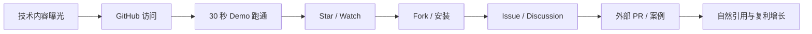
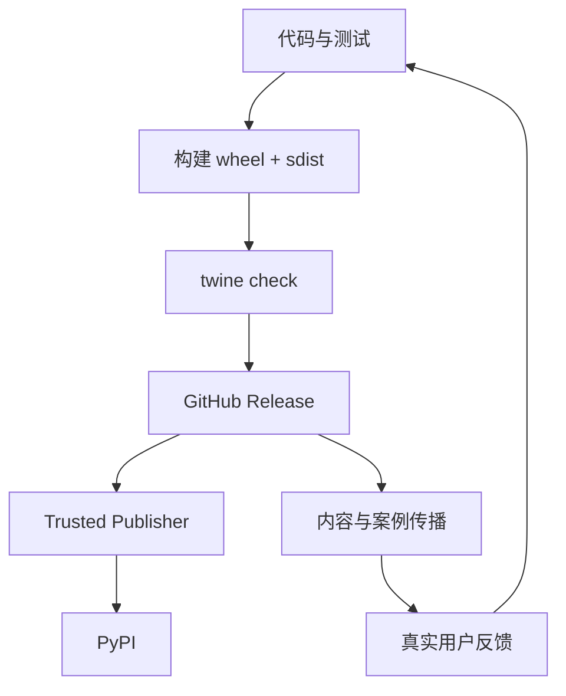
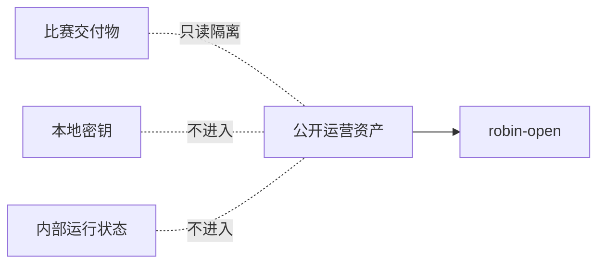

# Robin Open 运营仪表盘

> 更新时间：2026-07-23。数据来自 GitHub 公共仓库实时指标；本页不自动执行互动，不购买或刷星。

## 当前基线

| 指标 | 当前值 | 解释 |
|---|---:|---|
| Stars | 0 | 新公开项目自然增长基线 |
| Forks | 0 | 尚未形成外部复用 |
| Watchers | 0 | 尚未形成持续关注 |
| Open Issues | 5 | 已有 5 个可执行贡献入口 |
| Release | v0.2.0 | 当前公开版本 |
| CI | success | 主测试流程通过 |
| Discussions | enabled | 已开启问答与 Showcase 入口 |
| PyPI | pending publisher setup | 包已构建并通过 `twine check` |

## 增长漏斗

当前瓶颈不是仓库配置，而是 `A -> B -> C`：需要真实开发者流量和可复现案例。

## 发布闭环

当前 `wheel`、`sdist` 和 `twine check` 已通过；PyPI 发布等待 GitHub Trusted Publisher 配置完成。

## 30 天执行节奏

| 周期 | 运营动作 | 验收信号 |
|---|---|---|
| 第 1 周 | 发布终端 Demo 与案例文章 | 首批访问、Issue、Discussion |
| 第 2 周 | 推广 OpenAI-compatible / 本地模型示例 | Fork、安装反馈 |
| 第 3 周 | 发布 SQLite trace 或 Ollama 适配器 | 外部 PR 或复用案例 |
| 第 4 周 | 发布 benchmark 与 `v0.3.0` 规划 | 外部引用、持续 Watch |

## 硬边界

- 不发布 `competition/**`、`server/competition/**`、`server/比赛准备/**`。
- 不把密钥写入仓库、报告、Issue、Release 或工作流参数。
- 不自动 Star、评论、私信、关注或批量制造互动。
